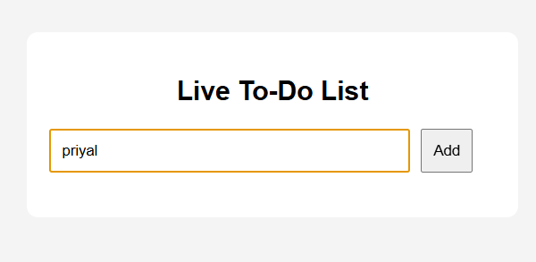
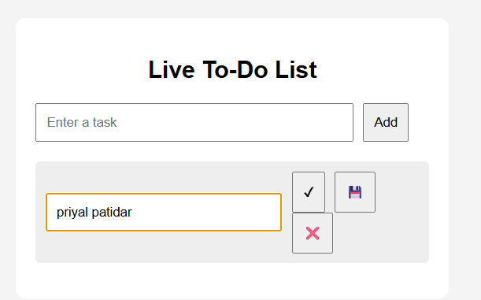
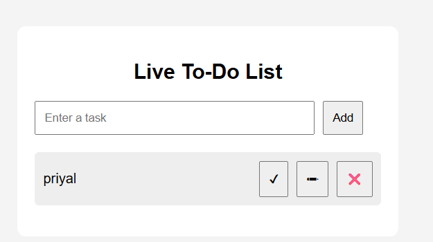

# Live-To-Do-List
A live to-do list that takes alphanumeric characters and do CRUD operation.
# 📝 Live To-Do List

A simple and interactive **Live To-Do List Web App** built using **HTML, CSS, and jQuery**.  
This application allows users to manage daily tasks efficiently with real-time updates.

---

## 🚀 Features

- ➕ Add new tasks
- ✏️ Edit tasks
- ✔️ Mark tasks as completed
- ❌ Delete tasks
- 💾 Save updated tasks
- ⚡ Instant UI updates without page reload

---

## 🖼️ Screenshots

> Add your screenshots inside a `screenshots` folder and update the file names below.

### 📌 Add Task


### 📌 Edit Task


### 📌 Task Actions


---

## 🛠️ Technologies Used

- **HTML5** – Structure  
- **CSS3** – Styling  
- **jQuery (3.6.0)** – DOM manipulation  

---

## 📂 Project Structure
live-todo-list/
│── index.html
│── README.md
│── screenshots/
│ ├── add-task.png
│ ├── edit-task.png
│ └── task-actions.png


---

## ⚙️ How to Run

1. Clone the repository:
   ```bash
   git clone https://github.com/your-username/live-todo-list.git

2. Open the project folder:
   cd live-todo-list

3. Open index.html in any browser.     
